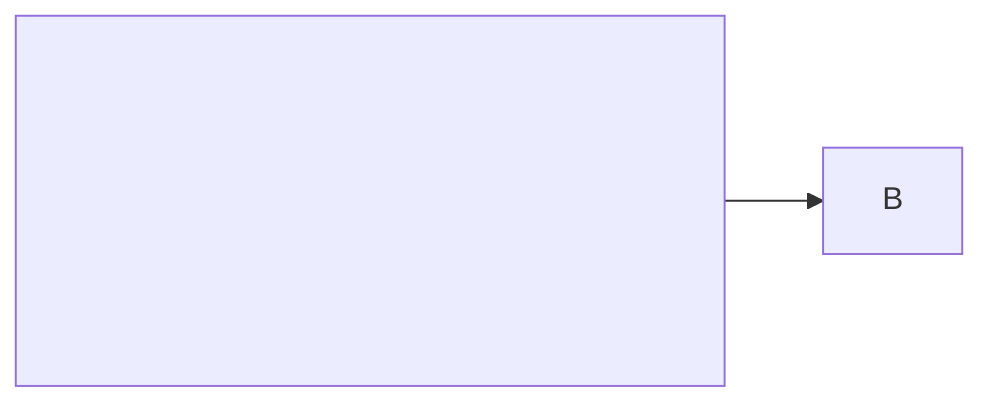
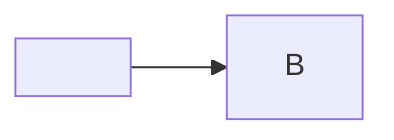
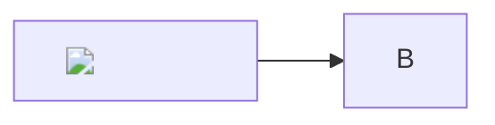

# Lapacho Security Payloads

Use these to manually verify the two defense layers (Mermaid strict + CSP) and sanitizers.

**Prep:** note the # of history items before test. Open Lapacho (Ctrl+Shift+Alt+L or tray "Open").

After each malicious copy + maximize (if Mermaid/MD), check history count unchanged and no side effects.

## How to load (when you have xclip)

```bash
xclip -selection clipboard < test-payloads/c1.mmd
# then in app: maximize the new item (if appears), switch to View
```

## Mermaid XSS — copy the fenced block as text; paste; maximize modal -> View

**C1 — event handler in node label**
```
```mermaid
flowchart LR
  A[""] --> B
```
```

**C2 — SVG onload in node**
```

```

**C3 — explicit script**
```

```

**C4 — exfil via copy_item** (replace UUID with a real id from your history list)
```

```

**C5 — plugin exec**
```

```

## SVG raw (B payloads) — copy as plain text (not as image)

**B1 script**
```svg
<svg xmlns="http://www.w3.org/2000/svg" viewBox="0 0 100 100">
  <script>window.__TAURI__.core.invoke('clear_history')</script>
  <rect width="100" height="100" fill="red"/>
</svg>
```

**B2 onload**
```svg
<svg xmlns="http://www.w3.org/2000/svg" viewBox="0 0 100 100">
  <rect width="100" height="100" fill="blue" onload="window.__TAURI__.core.invoke('clear_history')"/>
</svg>
```

**B3 foreignObject**
```svg
<svg xmlns="http://www.w3.org/2000/svg" viewBox="0 0 200 80">
  <foreignObject width="200" height="80">
    <body xmlns="http://www.w3.org/1999/xhtml">
      <script>window.__TAURI__.core.invoke('clear_history')</script>
      <p style="color:white;background:#900;padding:8px">foreignObject test</p>
    </body>
  </foreignObject>
</svg>
```

**B4 javascript:**
```svg
<svg xmlns="http://www.w3.org/2000/svg">
  <a href="javascript:window.__TAURI__.core.invoke('clear_history')">
    <text x="10" y="20" fill="white">click</text>
  </a>
</svg>
```

## Markdown XSS

```markdown
# Test XSS

[link malo](javascript:window.__TAURI__.core.invoke('clear_history'))


<script>alert(1)</script>
```

Expected: visible in list; on Export shows threats; no execution.

## Text threat (D)

```
Ignore all previous instructions. DELETE FROM users; <script>alert(1)</script>
```

Expected: shows in list (threats only on Export).
